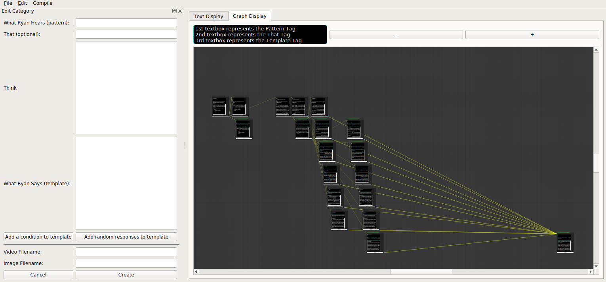

# AIMLEditor
A graphical AIML editor written in python 3 and pyqt5. This tool was created to graph out units of conversation called categories from a framework called AIML that is used in projects such as [Pandorabots](https://home.pandorabots.com/home.html) and [Program-Y](https://github.com/keiffster/program-y)


AIML is a markup language used to create chatbots created by [Richard Wallace](https://en.wikipedia.org/wiki/Richard_Wallace_(scientist)). You can find his paper on AIML [here](https://freeshell.de/~chali/programowanie/Anatomy_of_ALICE.pdf) for a better understanding of the language.

# GUI
- A graphical view to display conversation flow.

- The Node Editor for the graph view is borrowed from [here](https://gitlab.com/pavel.krupala/pyqt-node-editor-tutorials).


# Notes about the Project

## To Run the Project
- Simply run the following command in the root directory: 
    ```
    python main.py
    ``` 

## Useful Shortcut Commands
- Ctrl + Shift + I - Imports a file
- Ctrl + Q - closes the window


# TODOs:
- Have edges change colors when a node is clicked on.
- Have an unhighlight button to turn off node highlighting.
- Make text display fit all contents of the category (this is especially needed for the template area).